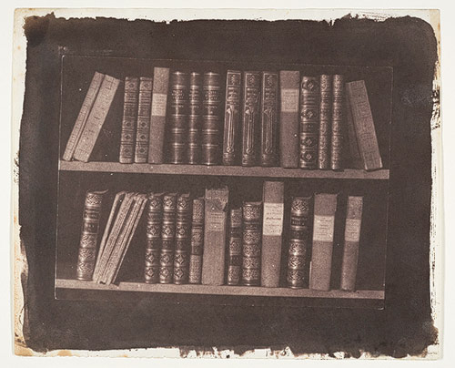

## Introduction à la photolittéature

<!-- .element: style="width:450px" -->

Enseignante : Servanne Monjour [servanne.monjour@sorbonne-universite.fr]

<!-- .element: style="font-size:1.3rem"-->

 <!-- .element: class="logo" -->

===

%%%%%%%%%%%%%%%%%%%%%%%%%%%%%%%%%%%%%%%%%%%%%

### [Séance 1] 
### Les "inventions littéraires de la photographie"

<!-- .element: style="width:300px" -->

§§§§§§§§§§§§§§§§§§§§§§§§§§§§§§§§§§§§§§§§§§§§§

### Ceci n'est pas une pipe 

#### La relation texte/image, une problématique de la représentation

Si ceci n'est pas une pipe, qu'est-ce que c'est ?

<!-- .element: style="font-size:1.6rem;width:40%;float:left;margin-right:-1em;" -->

<!-- .element: style="width:40%;float:right;margin-right:-1em;" -->

===

L’image est-elle d’ordre textuel ou visuel ?
Elle est les deux à la fois : une photographie, un tableau sont des images. Une métaphore, association impertinente de deux termes = image mentale.

§§§§§§§§§§§§§§§§§§§§§§§§§§§§§§§§§§§§§§§§§§§§§

#### Magritte, « La trahison des images » (1929)

* Une représentation visuelle (dessin, peinture, photo) d'un objet marque toujours un écart avec cet objet
* Une représentation textuelle, linguistique marque un écart encore plus grand avec son référent
* « Le mot "chien" ne mord pas» (William James)

<!-- .element: style="font-size:1.6rem;width:40%;float:left;margin-right:-1em;" -->

<!-- .element: style="width:40%;float:right;margin-right:-1em;" -->

===

Il faut, encore une fois, replacer le concept d’image au cœur de la problématique de la représentation : Question de la valeur de deux modes de représentation : représentation visuelle, représentation textuelle. 

Exemple de Magritte : 
« La trahison des images » (1929) est un des tableaux les plus célèbre de René Magritte. 

Ici, Magritte marque la rupture entre l’objet et sa représentation : même la technique de représentation la plus réaliste (picturale, photographique, plastique) d’un objet, ne peut être considérée comme l’équivalent même de cet objet. 
Le tableau qui représente une pipe n’est pas une pipe. 
La sculpture qui représente une pipe n’est pas la pipe.
Tout ceci ne reste qu’une image de pipe qu'on ne peut pas fumer.
 
Magritte a développé ce discours de l’écart entre l’objet, son identification et sa représentation dans une large partie de son œuvre.

Mais ce qui est intéressant ici, c’est le principe du tableau-mot : on travaille autant le textuel que le visuel. Car le mot écrit « pipe » n’est pas non plus une pipe. 
Si je vous dis « chaise », vous ne pourrez vous asseoir dessus. Tout comme « Le mot "chien" ne mord pas», comme le disait le sémiologue américain William James.
 
Vous pouvez fumer une pipe, mais vous ne pouvez pas fumer l’image de la pipe, ni le mot pipe. À ce titre, l’écriture et la peinture, le texte et l’image visuelle sont tous deux des formes de langage, des formes de la représentation, que l’on doit considérer comme des conventions. 

§§§§§§§§§§§§§§§§§§§§§§§§§§§§§§§§§§§§§§§§§§§§§

### La dimension graphique du texte

* On l'oublie souvent : le texte est d'abord un signe graphique et un objet visuel !

<!-- .element: style="font-size:1.6rem;width:40%;float:left;margin-right:-1em;" -->

<!-- .element: style="width:40%;float:right;margin-right:-1em;" -->

===

Le visuel : ce qui se rapporte à la vue, ce qui fait appel à la vue : caractère optique.

On aurait donc d’un côté les arts visuels comme champ d’étude de l’Histoire de l’art (arts plastiques tradictionnels, peinture, sculpture, dessin, ainsi que les arts plus moderne : photo, cinéma), par opposition au texte comme champ d’étude de la littérature.

Le concept est peut-être moins complexe que celui de texte, quoiqu’il comporte lui aussi quelques paradoxes : le texte est aussi un objet visuel. Par ailleurs, le visuel est associé à certaines notions connexes qui lui sont associées peuvent s’avérer tout à fait problématique : l’image.

§§§§§§§§§§§§§§§§§§§§§§§§§§§§§§§§§§§§§§§§§§§§§

### Qu'est-ce qui fait image ? QUI fait image ? 

La capacité imageante de l'homme, qui *met en forme* et interprète ce qu'il voit comme un signe.

<!-- .element: style="font-size:1.6rem;width:40%;float:left;margin-right:-1em;" -->

<!-- .element: style="width:40%;float:right;margin-right:-1em;" -->

====

Vouilloux : qui fait image ? Voir notre exemple avec les nuages. Ici, c’est toujours la capacité imageante de l’homme qui crée l’image.

§§§§§§§§§§§§§§§§§§§§§§§§§§§§§§§§§§§§§§§§§§§§§

### Qu'est-ce qu'une photo ?

* Invention officielle : 1849
* Niepce (Angleterre)
* Daguerre (France)

<!-- .element: style="font-size:1.6rem;width:40%;float:left;margin-right:-1em;" -->

<!-- .element: style="width:40%;float:right;margin-right:-1em;" -->

===

Invention de la photo = 1849
Invention conjointe en France et en Angleterre
France : Niepce et Daguerre (daguerréotype)
Angleterre : Talbot 

§§§§§§§§§§§§§§§§§§§§§§§§§§§§§§§§§§§§§§§§§§§§§

### Une technique
* Argentique : photosensibilité 
* Image acheiropoiëtique (qui n'est pas *construite par la main de l'homme*) ? 
* L'appareil-photo : un outil scientifique plutôt qu'une technique artistique
* Le photographe : artiste ou technicien ?

<!-- .element: style="font-size:1.6rem;width:40%;float:left;margin-right:-1em;" -->

<!-- .element: style="width:40%;float:right;margin-right:-1em;" -->

===

Tout un discours considère le photographe comme un technicien, avant de le reconnaître comme un artiste. Catégorie intermédiaire = le photoreporter, qui reste pendant toute la première partie du 20e siècle une sorte de héros romanesque.

À l’origine, un premier malentendu est généré par les inventeurs du médium photographique, qui à force d’en vanter l’aspect technologiquement révolutionnaire, vont faire croire qu’il s’agit là d’un médium d’enregistrement capable de l’objectivité la plus parfaite, capable de seconder la nature, d’offrir une vision panoptique (càd tout voir, voir mieux que l’œil, voir l’invisible, offrir une supra-perception). 

Talbot : « Pencil of Nature » = le crayon de la nature : photographie = écriture de la lumière, et non du photographie. Quelque chose de « naturel », d’œuvre de la nature

C’est l’idée de l’image « acheiropoïète » = « non fait de main d’homme » (image naturelle).

§§§§§§§§§§§§§§§§§§§§§§§§§§§§§§§§§§§§§§§§§§§§§

### Une empreinte du réel
* Valeur testimoniale / preuve du réel
* Trace du passé
* "Ça a été" (Roland Barthes)

<!-- .element: style="font-size:1.6rem;width:40%;float:left;margin-right:-1em;" -->

<!-- .element: style="width:40%;float:right;margin-right:-1em;" -->

===

Note sur le fonctionnement de la photo argentique (procédés à développement) :
Invention de la photo est liée à des découvertes scientifiques notamment dans le domaine de la chimie.
À la base de la photographie : découverte que les ions d’argent (cristaux d’halogénures d’argent ou de bromure d’argent) sont photosensibles : c’est-à-dire qu’ils réagissent à la lumière. Les premiers photographes vont donc créer une émulsion qui mélange ces cristaux d’argents (halogénures au début de la photographie) à de la gélatine. Au tout début, on appliquait juste avant de prendre la photo cette couche sur une plaque photographique (généralement en verre), le film, la pellicule, ne sont apparus qu’après l’invention du cinéma.

1° Exposition : (prise de la photo) : Lorsque les cristaux d’argent sont insolés, il se forme à l’échelle de l’atome une image imperceptible à l’œil nu, que l’on a coutume d’appeler « image latente ».

2° Travail en chambre noire : Cette image latente plurielle est transformée en un unique négatif lors du traitement en chambre noire où elle est d’abord soumise au révélateur, solution chimique modifiant de nouveau la structure de l’argent pour le rendre à la fois visible et insensible à la lumière.
Autres procédures : l’épreuve est successivement plongée dans un bain d’arrêt, fixée, lavée, et enfin séchée. 

3° Négatif > positif : Cependant, le négatif obtenu n’est pas la photographie (l’image est à l’envers) ; il faut encore le développer en réitérant les six opérations essentielles à la création des images latentes et leur transformation en négatif : exposition, révélation, arrêt, fixage, rinçage, séchage.

§§§§§§§§§§§§§§§§§§§§§§§§§§§§§§§§§§§§§§§§§§§§§

### Une transfiguration / révélation du réel 
* Voir l'invisible, voir le réel comme on ne peut pas le voir (et comme il n'existe pas vraiment ?)
* Réinventer le sens de la vue : le concept de "détail" n'est plus le même depuis l'invention de la photographique argentique (qui fixe l'empreinte laissée par la lumière), et encore plus de la photo numérique (à l'échelle du pixel)

<!-- .element: style="font-size:1.6rem;width:40%;float:left;margin-right:-1em;" -->

<!-- .element: style="width:40%;float:right;margin-right:-1em;" -->

===

Edgerton

§§§§§§§§§§§§§§§§§§§§§§§§§§§§§§§§§§§§§§§§§§§§§

### Une icône 
* Valeur symbolique
* Le message > le réel
* Une problématique éthique 

<!-- .element: style="font-size:1.6rem;width:40%;float:left;margin-right:-1em;" -->

<!-- .element: style="width:40%;float:right;margin-right:-1em;" -->

===

icône

§§§§§§§§§§§§§§§§§§§§§§§§§§§§§§§§§§§§§§§§§§§§§

### Une oeuvre d'art
* Vers des photographies de moins en moins figuratives, de plus en plus mises en scène, retouchées ou manipulées
* Des artistes-photographes
* Entrée de la photographie au musée : 1960-1970

<!-- .element: style="font-size:1.6rem;width:40%;float:left;margin-right:-1em;" -->

<!-- .element: style="width:40%;float:right;margin-right:-1em;" -->

§§§§§§§§§§§§§§§§§§§§§§§§§§§§§§§§§§§§§§§§§§§§§

### Une construction discursive, imaginaire
* La photographie est ce que l'on définit comme photographie, ce que l'on *raconte sur la photographie*
* Un média est une construction plurielle : technique, institutionnelle, discursive
* L'imaginaire des médias est aussi déterminant que leur "réalité" technique et pratique
* = fictions théoriques

<!-- .element: style="font-size:1.6rem;width:40%;float:left;margin-right:-1em;" -->

<!-- .element: style="width:40%;float:right;margin-right:-1em;" -->

===

§§§§§§§§§§§§§§§§§§§§§§§§§§§§§§§§§§§§§§§§§§§§§

#### Le Suaire de Turin, une relique popularisée par une fiction théorique photographique

Le cas du Suaire illustre sans doute parfaitement la réception complexe et paradoxale du fait photographique, encore mal compris dans les années qui ont suivi son invention, une confusion dont l’imaginaire collectif ne s’est toujours pas complètement affranchi. L’image, garante d’une démarche scientifique et rationnelle, admet cependant une lecture magique largement fantasmée à laquelle, paradoxalement, les courants scientistes ne sont sans doute pas étrangers.

<!-- .element: style="font-size:1.6rem;width:40%;float:left;margin-right:-1em;" -->

<!-- .element: style="width:40%;float:right;margin-right:-1em;" -->

===

Le cas du Suaire de Turin

Saint Suaire de Turin = drap qui aurait enveloppé le Christ après sa crucifixion, conservant la trace imprimée de son visage et de son corps mutilé. Le récit pour le moins confus de la transmission du Linceul à travers les âges en fait une relique aux origines bien douteuses, contestée au sein même de la communauté chrétienne, jusqu’au 19è siècle. 

Première mention du Suaire de Turin : 14e siècle en Champagne (France), justement dans les édit des autorités ecclésiastiques qui interdisent l’ostension de la relique, jugée fausse.
Au début du XVe, la France est envahie par des hordes de brigands, et l’insécurité est particulièrement importante. Le Suaire est alors déplacé, et commence à « voyager » un peu partout : Liège, Genève, Annecy, Paris, Nice, Turin ou encore Chambéry … où il restera plusieurs années : des aménagements sont réalisés pour lui accorder une place définitive dans une chapelle construite à l’occasion. La Chapelle brûle, et le Suaire échappe de peu à l’incendie. Finalement, à la fin du XVIe siècle, il atterrit à Turin, où il repose depuis.
Le Suaire est exposé aux fidèles en de très rares occasions. C’est à l’une d’entre elles qu’en 1898, l’italien Secondo Pia obtient l’autorisation de photographier le Linceul pour la première fois. 
Nous sommes le 28 mai 1898, le Suaire est exceptionnellement exposé au public dans le cadre des festivités qui entourent le mariage de Victor-Emmanuel (futur roi) et d’Hélène de Monténégro. Les pèlerins affluent en masse autour de la relique, et Secondo doit patiemment attendre que la cathédrale se vide. Alors qu’il est déjà près de minuit, le photographe effectue enfin les derniers réglages de son appareil, prend le linceul en photo, et se précipite dans sa chambre noire. Là, il plonge sa plaque de verre dans le révélateur et… voit apparaître très clairement un visage. Secondo Pia devient ainsi le premier photographe du Christ.

Si la photographie de Pia prend une telle importance, c’est que le linceul de Turin ne nous montre, à vrai dire, pas grand chose sinon quelques taches : l’image, l’empreinte du corps, est à peine perceptible. Par contre, la plaque de verre que Pia sort du bain révélateur présente un visage incroyablement net et détaillé. Les différents commentateurs vont ainsi immédiatement assimiler le drap à une image déjà inversée, c’est-à-dire à un « négatif » dont la plaque de verre révélée par Secondo Pia (soit, le véritable négatif photographique) serait le positif… 

Trois éléments à retenir de l’anecdote du Suaire :
    1) image acheiropoïète = non faite de main d’homme. Rapport à la machine d’enregistrement. Conséquences sur la photo : ce n’est pas un art mais une technique (chimie, laboratoire), le photographe n’est pas un artiste mais un opérateur de la machine, doublé d’un chimiste.
    2) Icône. Rapport religieux à la photo, qui procède à la fois d’une reconnaissance de son aspect magique, et de son aspect objectif (qui attrait à la vérité). Problème du scientisme, qui se même au fantasme.
    3) Memento Mori. Notamment rapport à la mort : la photo suspend-t-elle la mort ? 

le Suaire de Turin démontre bien ce processus de double invention réciproque entre la photographie et un autre objet (que ce soit le Suaire ou la littérature). Après l’expérience de Secondo Pia, le Suaire sera exclusivement commenté à travers le jargon de la photographie. Il est encore aujourd’hui souvent considéré comme un « négatif » (tout comme le révélateur, le négatif est un adjectif substantivé par les photographes, à partir de l’épreuve négative), attendant d’être « révélé » depuis près de deux mille ans. S’il est évident qu’avec l’image du Suaire l’Église est « en train d’inventer le mythe de la photographie comme évidence mystique et preuve sans appel du vrai », l’inverse est aussi vrai : les photographes-sindonologistes s’approprient la relique pour en faire le symbole de la puissance à la fois magique et scientifique de leur médium. 

De ce point de vue, le cas du Suaire illustre sans doute parfaitement la réception complexe et paradoxale du fait photographique, encore mal compris dans les années qui ont suivi son invention, une confusion dont l’imaginaire collectif ne s’est toujours pas complètement affranchi. L’image, garante d’une démarche scientifique et rationnelle, admet cependant une lecture magique largement fantasmée à laquelle, paradoxalement, les courants scientistes ne sont sans doute pas étrangers.

Sur les bases d’une fonction « négative » (au sens photographique) du linceul, les procédures techniques de la photographie ont largement conditionné les discours conçus autour du Linceul du Turin depuis la fin du XIXe siècle, selon un phénomène encore perceptible dans des « études » plus récentes. Sur le site http://holyshroudguild.org, gigantesque base de donnée qui regroupe les « articles » cherchant à démontrer l’authenticité du voile (ou, au moins, conservant une certaine ambiguïté à son égard), se trouve un texte de Kevin Moran, écrit en 1995, souvent repris depuis par ses camarades sindonologistes : 

>I have been able to photograph some of these specimens with a research grade Olympus Vanox microscope using 35mm negative colour film that was scanned to Kodak Photo CD rom. Disks with some of these pictures can be obtained through the Holy Shroud Guild of Esopus, NY, USA. The pictures can be viewed on multi-media computers and imported into your research documents. […] Because of my interest in how the image was formed, I have examined the image-forming pixels or segments of the fibre that have the darker yellowing. I have dubbed the elements 'pixels' to draw attention to the fact that they are optically terminated. [J’ai examiné les pixels formant l’image, soit les morceaux de tissu d’un jaune plus foncé. Je rebaptise ces éléments « pixels », pour attirer l’attention sur le fait qu’ils sont visiblement délimités.] They are very sharply defined at their ends. They are not diffused spots that would be seen if they were dyed or chemically reacted, or a thermal burn. They are most certainly not made by pigment contact.

Ainsi, l’idée selon laquelle la photographie est capable de « révéler » le Suaire, d’en démontrer l’authenticité et la sainteté reste persistante. De plus, elle s’est adaptée aux nouveaux développements techniques de la photographie, notamment numériques. C’est ainsi que, de façon plus anachronique encore qu’auparavant, le Suaire est désormais « pixélisé »… et la métaphore de la révélation remise au goût du jour.

§§§§§§§§§§§§§§§§§§§§§§§§§§§§§§§§§§§§§§§§§§§§§

### Photolittérature ?
* Des livres avec du texte et de la photographie
* Des livres qui parlent de la photographie : une mythologie en marche

===

La littérature a joué un rôle considérable dans ce débat, elle qui n’a pas toujours bien accueilli la photographie dans le paysage technico-artistique du 19è.

§§§§§§§§§§§§§§§§§§§§§§§§§§§§§§§§§§§§§§§§§§§§§

### Les inventions littéraires de la photographie

>« Le titre de ce livre est donc à double entente. D’un côté la littérature invente la photographie : elle en imagine les fictions vraies, elle l’érige en questions subjectives et lui attribue des valeurs ; et d’un autre côté, la photographie invente la littérature : elle la redétermine de part en part, l’oblige à une expérience inédite, la somme de se ressaisir à nouveaux frais devant elle. »

>Jérôme Thélot, *Les inventions littéraires de la photographie*

<!-- .element: style="font-size:1.6rem" -->

§§§§§§§§§§§§§§§§§§§§§§§§§§§§§§§§§§§§§§§§§§§§§

### Ce que la photographie fait à la littérature
* Une reconfiguration du rapport de la littérature au réel (la photographie souligne le caractère médiat et fictionnel du langage)
* Une source d'inspiration et un ressort fictionnel efficace (la photographie sert plusieurs fonctions dans le récit et l'intrigue)

===

A comprendre dans un double sens : inventions littéraires de la photographie : 
    • ce que la photo fait à la littérature. Il y avait, dans la littérature, une fonction d’enregistrement très forte : littérature comme façon de collecter la mémoire, le témoignage du passé. La littérature se trouve donc éminemment concurrencée par la photographie, qui s’impose comme médium d’enregistrement par excellence. Davantage, la littérature est amenée à reconfigurer son rapport au réel : La photographie souligne le caractère médiat et fictionnel, du langage, vs la photographie, immédiate et mimétique (elle est un enregistrement de la lumière). Pour certains, la photo serait notamment à l’origine de la crise du langage, puisqu’elle serait un mode de représentation du réel plus efficace que le langage (qui apparaît alors plus que jamais comme un code).

Une source d'inspiration et un ressort fictionnel efficace (la photographie sert plusieurs fonctions dans le récit et l'intrigue), par exemple elle vient embrayer un récit, résoudre une enquête.

§§§§§§§§§§§§§§§§§§§§§§§§§§§§§§§§§§§§§§§§§§§§§

### Ce que la littérature fait à la photographie
* La littérature construit un imaginaire de la photographie (= fictions théorique) où les pouvoirs fantasmés de la technique auront tendance à s’inscrire durablement, dans l’imaginaire collectif

===
    • ce que la littérature fait à la photo : au XIXe siècle, les premiers observateurs de la photographie sont les écrivains, qui vont intégrer le nouveau médium à la fiction, notamment d’un point de vue thématique (récit sur les pouvoirs de la photo = fictions théoriques). La littérature va ainsi participer à la constitution d’un imaginaire de la photographie, où les pouvoirs fantasmés de la technique auront tendance à s’inscrire durablement, dans l’imaginaire collectif, comme des vérités.

§§§§§§§§§§§§§§§§§§§§§§§§§§§§§§§§§§§§§§§§§§§§§

#### Exercice : l'oeil du mort, ou le mythe de l'optogramme

Autour des *Frères Kip*, Jules Verne (1902)

<!-- .element: style="width:30%;float:right;margin-right:-1em;" -->

<!-- .element: style="width:40%;float:left;margin-right:-1em;" -->

===

19è = siècle des révolutions industrielles, de la Modernité, des grands progrès scientifiques, des grandes inventions. C’est un siècle qui est marqué par l’avènement du politique : les monarchies sont détruites ou affaiblies, elles doivent du moins composer avec une nouvelle conception de la république : les pouvoirs sont partagés.
État moderne qui requiert la séparation du théologique et du politique. 

L’influence de la religiosité chez les penseurs du XIXe siècle est cependant considérable. Si le 19e est un siècle où l’on rejette beaucoup les dogmes de l’Église, les penseurs ont du mal à s’affranchir d’un mode de pensée, d’un raisonnement qui en fait est imprégné de religion. Ceux là mêmes qui récusent l’autorité d’une église n’échappent pas à la tentation d’un religion nouvelle : besoin de dogmes encore très fort. Et dans le cadre de ce besoin de dogme, la science va faire office de nouvelle religion (scientisme = croyance en laquelle la science a réponse à tout, est capable de tout, que toute connaissance ne peut être atteinte que par les sciences, particulièrement les sciences physico-chimiques, et qui attend d'elles la solution des problèmes humains). 

p. 29 : « Science et religion sont deux mots identiques ; ces deux mots expriment deux versants du même fait, qui est l’infini. La Religion-Science, c’est l’avenir de l’âme humaine ».
Ainsi, croyance en laquelle la photographie serait capable de tout montrer, de tout révéler.

§§§§§§§§§§§§§§§§§§§§§§§§§§§§§§§§§§§§§§§§§§§§§

### Conclusion

La littérature crée une mythologie de la photographie, la photographie ouvre de nouveaux horizons thématiques à la littérature, qui par ailleurs est amenée à revoir entièrement son rapport au réel. C'est ce que l'on appelle les inventions littéraires de la photographie, constituées de nombreuses fictions théoriques à l'origine d'une mythologie du media photographique qui va durablement marquer l'imaginaire collectif. Ces fictions sont étudiées dans le champ des études photolittéraires, auxquelles ce semestre sera consacré.

<!-- .element: style="font-size:1.6rem" -->

===

