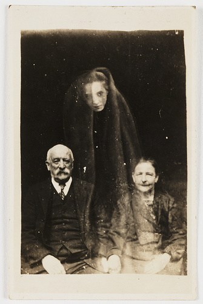
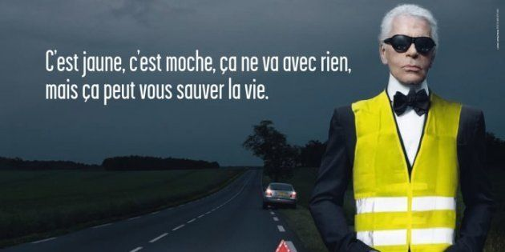
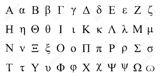
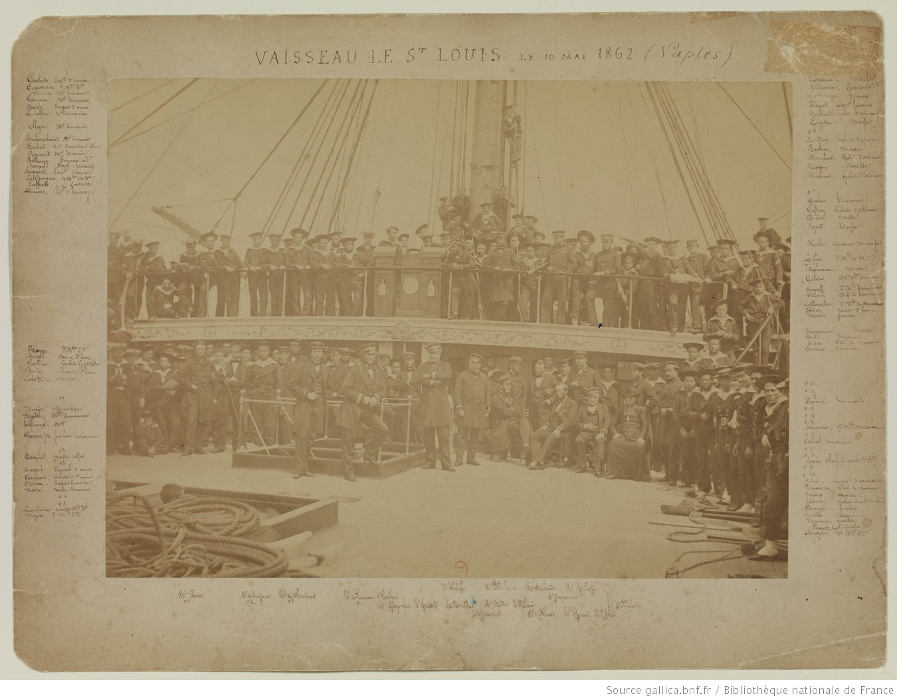
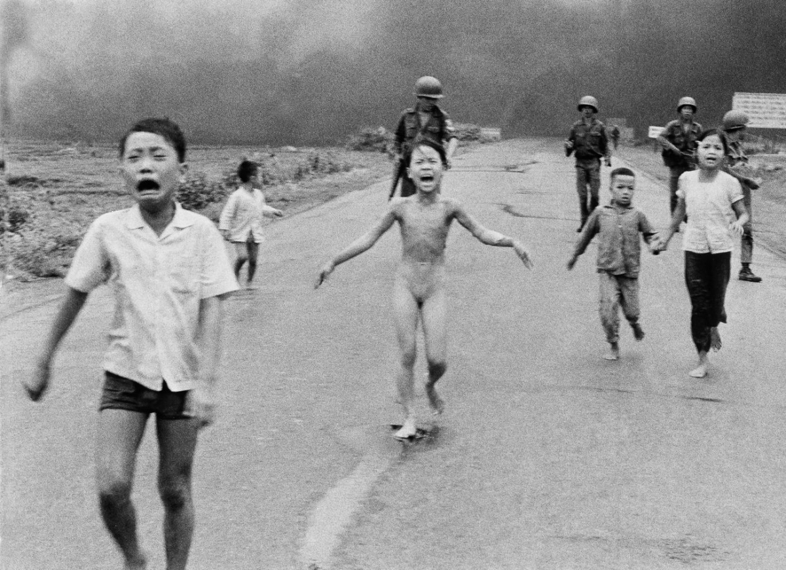

### [Séance 2] 

### De la sémiotique à l'ontologie des images

<!-- .element: style="width:250px" -->

§§§§§§§§§§§§§§§§§§§§§§§§§§§§§§§§§§§§§§§§§§§§§

### Roland Barthes

<!-- .element: style="width:400px" -->

<!-- .element: style="width:50%;float:right;margin-right:-3em;" -->

Roland Barthes (1915-1980) est critique littéraire et sémiologue français. Il fût l’un des principaux animateurs du post-structuralisme et de la sémiologie linguistique en France.

<!-- .element: style="font-size:1.5rem; width:50%;float:left;margin-left:-3em;" -->

§§§§§§§§§§§§§§§§§§§§§§§§§§§§§§§§§§§§§§§§§§§§§

### Roland Barthes et la photographie

- Une approche sémiotique
- Une approche littéraire et ontologique

===

On doit à Roland Barthes plusieurs travaux sur la photographie, caractérisés cependant par une évolution notable : si dans les années soixante Barthes se concentre sur une approche essentiellement sémiotique (« Le message photographique » (1961), « Rhétorique de l’image » (1964) ou « Le troisième sens » (1964)), il opère avec La Chambre claire (1980) un virage davantage ontologique. Cet essai, qui constitue autant une étude sur la photographie qu’un essai sur le deuil, est aujourd’hui le texte le plus influent de Barthes dans le champ de l’analyse de l’image et de la photolittérature.

§§§§§§§§§§§§§§§§§§§§§§§§§§§§§§§§§§§§§§§§§§§§§

### Sémiotique ? 

La sémiotique désigne la science des signes et de l'interprétation. Les signes, ce sont des phénomènes que je peux percevoir ou observer (un son, une odeur, une image...) et à partir desquels je vais tirer une interprétation, faire émerger une signification.

<!-- .element: style="font-size:1.6rem" -->

===

La sémiotique, en deux mots, c'est la science des signes. Les signes, ce sont des phénomènes que je peux percevoir ou observer (un son, une odeur, une image...) et à partir desquels je vais tirer une interprétation, faire émerger une signification.

La sémiotique est ainsi la science de l’interprétation, fondée sur la reconnaissance des signes -- lesquels répondent à un code établi et partagé par des interlocuteurs. 

§§§§§§§§§§§§§§§§§§§§§§§§§§§§§§§§§§§§§§§§§§§§§
<!-- .slide: data-background-image="img/giletjaune.jpeg" data-background-size="contain" -->

===

Pour comprendre la sémiotique, rien de mieux qu'une petite introduction pratique avec l'analyse d'une campagne de prévention pour la sécurité routière.

On y voit Karl Lagarfeld, le célèbre couturier, au bord d'une autoroute, vêtu d'un gilet jaune réfléchissant. Une inscription, entourée des guillemets de citation, énonce le message suivant : "C'est jaune, c'est moche, mais ça peut vous sauver la vie".

D'un point de vue communicationnel, la campagne de prévention est plutôt réussie:
1. Aspect comique : l'affiche est assez drôle, on va expliquer pourquoi tout à l'heure
2. Parce qu'elle est drôle, son Impact sera d'autant plus grand : elle l'attention du lecteur mais va aussi inscrire le message dans sa mémoire.

Pourquoi cette campagne fait-elle rire ? Pourquoi est-elle aussi efficace ? Si je mets une autre personnalité que Lagarfeld, aurais-je le même résultat ? Il y a fort à parier que non.

C'est qu'ici, le message joue non pas sur la scène en soit (assez triviale, un homme en panne de voiture au bord de la route avec son gilet jaune), mais sur les connotations associées aux différents éléments qui composent la scène.

§§§§§§§§§§§§§§§§§§§§§§§§§§§§§§§§§§§§§§§§§§§§§

<!-- .element: style="width:400px" -->

<!-- .element: style="width:50%;float:right;margin-right:-3em;" -->

1. Les symboles : Karl Lagarfled, une "image de marque" (luxe, excellence, sophistication)
2. Jeu de dissonance ; usage à "contre-emploi" de l'image de marque

<!-- .element: style="font-size:1.5rem; width:50%;float:left;margin-left:-3em;" -->

===

Surtout, la campagne est efficace car elle fait jouer des dissonances de codes et de connotations.

1. Les symboles : Karl Lagarfled. Un grand couturier que l'on croise plus souvent sur les défilés et plateaux de tv, plutôt qu'au bord de la route. Le choix de ce personnage emblématique d’un monde de luxe, d’excellence, de renommée internationale et la représentation fantasmagorique collective forgée à partir de ses nombreuses prestations médiatiques en font un lien de médiation fort avec le public. Lagarfeld, avec le temps, est devenu un personnage populaire.
Mais un personnage populaire qui incarne un certain nombre de valeurs : celle de la haute couture, du beau, du luxe.

2. Mais la campagne, pour fonctionner, repose aussi sur un principe de dissonance, en faisant éclater les symboles incarnés par Karl : le couturier, ici, est utilisé à contre-emploi. On le reconnait bien, mais voici qu'il revêt un gilet jaune réfléchissant, celui-là même qu'on aime pas trop porter mais qui est devenu obligatoire pour raison de sécurité. L'idée n'est pas de rendre ce gilet glamour -- impossible -- mais de rendre plus sympathique l'objet en le détournant.

§§§§§§§§§§§§§§§§§§§§§§§§§§§§§§§§§§§§§§§§§§§§§

La campagne de prévention joue sur mon horizon d'attente, c'est à dire sur mes représentations :

<!-- .element: style="font-size:1.6rem" -->

1) de la sécurité routière, des dangers de la route   
2) de la haute couture, du luxe

<!-- .element: style="font-size:1.6rem" -->

Elle détourne cet horizon d'attente afin de créer la surprise, susciter le rire, et finalement mieux faire passer un message : pour la sécurité de tous, mettons ces gilets jaunes peu seyants, mais qui garantissent aussi notre sécurité.

<!-- .element: style="font-size:1.6rem" -->

===

Creusons un peu plus cette question de la dissonance: la campagne joue sur mon horizon d'attente (c'est à dire sur mes représentations 1) de la sécurité routière, des dangers de la route 2) de la haute couture, du luxe), un horizon d'attente qu'elle détourne afin de créer la surprise, susciter le rire, et finalement mieux faire passer un message : pour la sécurité de tous, mettons ces gilets jaunes peu seyants, mais qui garantissent aussi notre sécurité.

Finalement, le message est le suivant: l’usage de la voiture peut être dangereux pour tous, même pour Karl. Nous sommes tous égaux en termes de sécurité routière. Un sujet bien terre à terre, mais très présent dans le quotidien des citoyens depuis maintenant plus de 100 ans.

Nous venons de nous livrer en quelques minutes à une analyse sémiotique : analyse des signes présentées, de leur signification, de la chaîne de sens qui se dessine à partir de ces signes.

Dans ce nouvel axe, nous allons creuser cette approche sémiotique. Nous allons passer en revue, dans les cm, les principaux concepts de la sémio, qui est à la fois une théorie et une méthodologie. En td, nous étudierons quelques textes + applications pratiques.

§§§§§§§§§§§§§§§§§§§§§§§§§§§§§§§§§§§§§§§§§§§§§

## À retenir
* Aucune représentation n'est neutre
* Toute représentation suppose une construction, une vision du monde
* Tout message repose sur des signes que nous interprétons en fonction de notre bagage culturel, social, etc.

<!-- .element: style="font-size:1.6rem" -->

===

* Aucune représentation n'est neutre : sans même aller jusqu'à dire qu'elle suppose une prise de position, elle repose en tt cas sur une vision du monde, une construction du réel, qui ne sera d'ailleurs pas nécessairement correctement comprise par nos interlocuteurs.
La compréhension d'un message repose sur la reconnaissance de codes partagés par une communauté. Dans mon exemple, si je ne connais pas Lagarfeld, je ne vais pas trouver très drôle la publicité...
Tout message repose sur des signes que nous interprétons en fonction de notre bagage culturel, social, etc.

§§§§§§§§§§§§§§§§§§§§§§§§§§§§§§§§§§§§§§§§§§§§§

## L'approche sémiotique
* Théorie / étude des signes et du sens
* En grec sêmeion = « signe » (dans l'antiquité : un terme médical)
* Un courant > XXe siècle : Ferdinand de Saussure, Charles Sanders Peirce, Roland Barthes, Umberto Eco
* Tout objet communicationnel ou médiatique constitue une unité faite de formes signifiantes
* Une méthodologie critique

<!-- .element: style="font-size:1.6rem" -->

===
Reprenons notre définition initiale, pour la pousser un peu plus loin.
C'est quoi la sémiotique ?

La sémiotique est la théorie et l'étude des signes et du sens.
Étymologie : du grec sêmeiôtikê, de sêmeion « signe » + logia = discours logique, rationnel.
Étude générale des systèmes de signes linguistiques et non linguistiques et des différents procédés de signification.

Le texte d'Umberto Eco que vous devez lire dans le cadre de cours, et dont l'étude sera développée dans vos TD, utilise une parabole qui reprend les origines mêmes de la sémiotique, à savoir la sémiologie médicale :

>La sémiologie médicale est la partie de la médecine qui étudie les signes (qui traduisent la lésion ou le trouble d’une fonction) que peut relever le médecin à l’examen clinique (signes physiques, signes fonctionnels et généraux) ou avec des examens complémentaires (imagerie, biologie), à partir desquels il dresse un tableau clinique. Elle étudie également la manière de les relever (interrogatoire, examen physique, examens complémentaires) et de les présenter (écriture d’une observation, regroupement en syndrome) afin de poser un diagnostic. (Wikipédia)

Comment interpréter des signes cliniques, des “symptômes”, pour les faire correspondre à une maladie déjà définie, catégorisée et décrite ? Le médecin doit reconnaître des signes correspondant à une pathologie précise.

En sémiotique, il s’agira de la même manière de reconnaître des signes et, à partir de ces signes, d’en tirer des conclusions correspondant à un état préalablement identifié. Il ne s’agit pas seulement de décrire des évidences, mais au contraire de déceler des signes parfois naturalisés (qu’on ne voit plus) qu’il convient d’identifier et d’interpréter.

Pour le sémioticien, tout est signe : l'homme même et le monde qui l'englobe. En particulier, les signes peuvent être linguistiques, picturaux, architecturaux, vestimentaires, gestuels, olfactifs, musicaux, filmiques, etc.

Un courant de pensée > XXe siècle : Ferdinand de Saussure, Charles Sanders Peirce, Roland Barthes, Umberto Eco. La sémiotique n'est pas une discipline, c'est une théorie assortie d'une méthologie critique (j'y reviendrai). Son origine est double, elle puise dans la linguistique de Saussure (versant langage) et dans la théorie des images de Ch. S. Peirce. De fait, il existe de nombreuses "Écoles", qui s'entendent globalement sur la définition de concepts clés, mais qui ont développé des précisions distinctes et des modèles d'analyse différents.

Je ne me référerai pas à une école précise ici, j'irai piocher ici et là des éléments de définition générale qui me semblent important, en précisant à qui je les emprunte à chaque fois.

§§§§§§§§§§§§§§§§§§§§§§§§§§§§§§§§§§§§§§§§§§§§§

La sémiotique est une manière de pratiquer les sciences de l'homme, un ensemble de concepts et de références qui depuis l'aube du XXe siècle marque les études littéraires, linguistiques, anthropologiques, philosophiques et esthétiques.

<!-- .element: style="font-size:1.6rem" -->

La sémiotique permet à la fois de décrypter les messages (application dans domaine politique : on va analyser les discours, les postures et jeux de langage des politiciens ; dans la publicité : comprendre les messages publicitaires, mais aussi participer à leur élaboration).

<!-- .element: style="font-size:1.6rem" -->

===

À quoi ça sert la sémiotique ?

La sémiotique est une manière de pratiquer les sciences de l'homme, un ensemble de concepts et de références qui depuis l'aube du XXe siècle marque les études littéraires, linguistiques, anthropologiques, philosophiques et esthétiques.

Il s'agit d'étudier le sens et ses manifestations dans la communication, c'est-à-dire à travers les multiples registres de signes qui existent dans les cultures.

Tout objet communicationnel constitue une unité faite de formes signifiantes et des contenus qu'elles signifient.

La sémiotique permet à la fois de décrypter les messages (application dans domaine politique : on va analyser les discours, les postures et jeux de langage des politiciens ; dans la publicité : comprendre les messages publicitaires, mais aussi participer à leur élaboration).

La sémiotique est une méthodologie pratique pour interprêter et critiquer les processus de signification, donc les messages.

§§§§§§§§§§§§§§§§§§§§§§§§§§§§§§§§§§§§§§§§§§§§§

## Analyser l'image : les outils sémiotiques
* Charles Sanders Peirce
* Le triangle sémiotique

===
http://www.surlimage.info/ecrits/semiologie.html

Ces deux termes sont synonymes. L’un et l’autre ont pour objet l’étude des signes et des systèmes de signification.

Sémiologie renvoie davantage à Saussure, à Barthes, à Metz et de façon plus générale à la tradition européenne où les sciences dites humaines restent plus ou moins attachées aux mouvements littéraires, esthétiques et philosophiques.

Sémiotique renvoie à Peirce, Morris et plus généralement à une tradition anglo-saxone marquée par la logique.

§§§§§§§§§§§§§§§§§§§§§§§§§§§§§§§§§§§§§§§§§§§§§
<!-- .slide: data-background-image="img/peirce-triangle.jpg" data-background-size="contain" -->

§§§§§§§§§§§§§§§§§§§§§§§§§§§§§§§§§§§§§§§§§§§§§

### Symbole

<!-- .element: style="width:400px" -->

===
Les symboles sont les mots, les chiffres, etc... Une deuxième coupure les sépare des icônes, la coupure sémiotique. Elle fait venir l'ordre, le code, l'arbitraire du signe, tout ce que veut dire logos : calcul, raison, langage, relation verbale, distinction, représentation, concept. Là commence le processus secondaire par opposition aux images (primaires)

§§§§§§§§§§§§§§§§§§§§§§§§§§§§§§§§§§§§§§§§§§§§§

### Indice

<!-- .element: style="width:400px" -->

===

A l'origine, il y a l'immense domaine des indices. L'indice est une trace, un échantillon du monde : la fumée est l'indice du feu, la rougeur l'indice de la fièvre, l'empreinte maque le passage de l'animal, etc... Il fonctionne par contact de manière matérielle, physique, en continuité. C'est une "partie de", un prélèvement.

En tant qu’indice (ou trace, empreinte), la photographie est supposée enregistrer le réel, capter un « instant décisif » (Cartier-Bresson).

Elle incarne autrement dit une valeur testimoniale aussi chère aux journalistes et au public que largement fantasmée : une image photographique n’est-elle pas toujours construite (cadrage, jeux de lumière, etc.) ? Peut-elle délivrer en soi une vérité « brute », ou n’est-elle pas plutôt toujours sujette à interprétation ?

Cette dimension indicielle de la photo fait régulièrement l’objet de débats dans la société et au sein des rédactions : peut-on tout montrer ? Par delà les questions de trucage ou de montage, la nature et les usages documentaires de la photographie sont sujet à interprétation et à discussion.

§§§§§§§§§§§§§§§§§§§§§§§§§§§§§§§§§§§§§§§§§§§§§

### Icône

<!-- .element: style="width:400px" -->

===
A partir de l'indice se détache la sphère des icônes. C'est un saut, une coupure, une rupture des continuités indicielles : le saut humain ou anthropologique par excellence. Exemples : un reflet dans l'eau, une ombre sur un mur, des mains primitives visibles dans une caverne, une image. L'icône s'ajoute au monde alors que l'indice est prélevé sur lui. En général elle est figurative, elle fonctionne sur un mode analogique (la ressemblance). Elle a un double tropisme, tantôt vers l'indice, tantôt vers le monde logico-langagier. Dans notre culture, les images sont subordonnées aux mots qui les cadrent, les légendent.

En tant qu’icône, une photographie n’est non seulement jamais neutre, mais porte en elle des imaginaires, des connotations particulièrement fortes. Cette dimension iconique de l’image documentaire – qui peut détourner son éthique documentaire – est pourtant ce qui fait aussi son efficacité : le soldat fauché par une balle lors de la guerre d’Espagne, la petite fille au napalm (Nick Ut, juin 1972), le manifestant debout face aux chars de la place Tian’anmen… ces images font littéralement l’histoire, et sont aujourd’hui ancrées dans notre culture populaire.

Cette dimension iconique du photojournalisme alimente aussi l’éternel débat de la photographie documentaire : quelle est la frontière entre art et information ? Quelle déontologie du photographe dans son rapport à l’image ? Une photo constitue t-elle vraiment une preuve ? C’est une chose de croire en l’adage « je ne crois que ce que je vois », mais justement, que vois-je vraiment ? Que me montre la photographie, son photographe, et le journal qui m’informe ?

§§§§§§§§§§§§§§§§§§§§§§§§§§§§§§§§§§§§§§§§§§§§§

### Vers une approche ontologique de la photographie

<!-- .element: style="width:250px" -->

§§§§§§§§§§§§§§§§§§§§§§§§§§§§§§§§§§§§§§§§§§§§§

### La photographie : un *memento mori*

>Les mythes principaux, les idées reçues à propos de la photographie, mous présentent celle-ci comme un *memento mori* mélancolique, une trace contingente de la réalité.

>Paul Edwards, *Soleil noir*

<!-- .element: style="font-size:1.6rem" -->

===

La photographie est très utilisée dans les récits photolittéraires du deuil. On dit en effet bien souvent qu’elle joue un rôle de “memento mori”. 

À votre avis, pourquoi ?

§§§§§§§§§§§§§§§§§§§§§§§§§§§§§§§§§§§§§§§§§§§§§

#### *Memento mori* : souviens-toi que tu vas mourir !

Memento mori : Memento mori est une locution latine qui signifie littéralement « Aie à l’esprit, à la pensée que tu meurs… », c’est-à-dire « Souviens-toi que tu te meurs », mais qui est généralement rendue en français par « Souviens-toi que tu vas mourir ». Par extension, un memento mori désigne également un objet ou une action destiné à rappeler le souvenir d’un ou des défunts.

<!-- .element: style="font-size:1.6rem" -->

§§§§§§§§§§§§§§§§§§§§§§§§§§§§§§§§§§§§§§§§§§§§§

### Exercice : La photographie comme memento mori : autour de *La Chambre claire* de Roland Barthes

Lorsqu’il rédige La Chambre claire, Roland Barthes vient tout juste de perdre sa mère, avec laquelle il entretenait une relation particulièrement fusionnelle. Ce deuil influence sa conception de l’image photographique, à tel point que l’on pourrait considérer l’ouvrage comme une réflexion sur le deuil, avant de le lire comme une « note sur la photographie », tel qu’il est pourtant sous-titré. 

<!-- .element: style="font-size:1.6rem;width:40%;float:left;margin-right:-1em;" -->

<!-- .element: style="width:40%;float:right;margin-right:-1em;" -->

===

Pourquoi ce titre, la cc ?

Lorsqu’il rédige La Chambre claire, Roland Barthes vient tout juste de perdre sa mère, avec laquelle il entretenait une relation particulièrement fusionnelle. Ce deuil influence sa conception de l’image photographique, à tel point que l’on pourrait considérer l’ouvrage comme une réflexion sur le deuil, avant de le lire comme une « note sur la photographie », tel qu’il est pourtant sous-titré. 

Il est vrai que, selon un mythe présent dans notre imaginaire collectif depuis l’invention de la photographie, et immédiatement relayé par la littérature, l’image photographique est dotée d’un pouvoir de résurrection. C’est ainsi qu’au XIXe siècle, alors que la mode du spiritisme battait son plein, l’idée que la photographie puisse capter les spectres fit naître un engouement jusque dans les plus hautes sphères culturelles, suscitant l’intérêt de figures telles que Victor Hugo. Il n’est bien entendu pas question d’un tel phénomène chez Barthes, pour lequel certaines photographies, transfigurant leur fonction mimétique, saisissent l’aura du défunt avec une telle acuité qu’elles en font surgir avec vivacité les qualités essentielles.

§§§§§§§§§§§§§§§§§§§§§§§§§§§§§§§§§§§§§§§§§§§§§

### La photographie selon Roland Barthes : du studium au punctum

Pour Barthes il existe deux caractéristiques de la photo&nbsp;: le studium et le punctum

§§§§§§§§§§§§§§§§§§§§§§§§§§§§§§§§§§§§§§§§§§§§§

### Le studium

Le studium : c’est ce qui, dans une photographie bien construite, attire mon attention lors d'un examen à caractère sémiotique. Le studium surgit après une analyse de la construction de l’image, des codes auxquels elle fait appel, décodage et lecture de l’image, pour en tirer une analyse du sens.

<!-- .element: style="font-size:1.6rem" -->

===

C) Théorie studium / punctum. Pour Barthes il existe deux caractéristiques de la photo : 

Le studium : c’est ce qui, dans une photographie bien construite, attire mon attention, mais une attention presque « clinique » = examen sémiotique, analyse de la construction de l’image, des codes auxquels elle fait appel, décodage et lecture de l’image, pour en tirer une analyse du sens.
« Ce que j’éprouve pour ces photos relève d’un affect moyen, presque d’un dressage. Je ne voyais pas, en français, de mots qui exprimât simplement cette sorte d’intérêt humain ; mais en latin, ce mot, je crois, existe : c’est le studium, qui ne veut pas dire du moins tout de suite, « l’étude », mais l’application à une chose, le goût pour quelqu’un, une sorte d’investissement général, empressé, certes, mais sans acuité particulière. » p.48
= les photos avec leur effet d’histoire

§§§§§§§§§§§§§§§§§§§§§§§§§§§§§§§§§§§§§§§§§§§§§

### Le punctum

Le punctum : c’est ce qui, dans une œuvre, vient plus profondément et *ontologiquement* me bouleverser. Le punctum renvoie à une expérience esthétique, expérience par laquelle, devant l’art, nous sommes submergés par l’émotion, au point de vivre une expérience de la transcendance, épiphanique.

<!-- .element: style="font-size:1.6rem" -->

===

Le punctum : c’est ce qui, dans une œuvre, vient plus profondément me bouleverser. Expérience esthétique, expérience par laquelle, devant l’art, nous sommes submergés par l’émotion, au point de vivre une expérience de la transcendance :
« Le second élément vient casser (ou scander) le studium. Cette fois, ce n’est pas moi qui vais le chercher (comme j’investis de ma conscience souveraine le champ du studium), c’est lui qui part de la scène, comme une flèche, et vient me percer. Un mot existe en latin pour désigner cette blessure, cette piqûre, cette marque faite par un instrument pointu ; ce mot m’irait d’autant mieux qu’il renvoie aussi à l’idée de ponctuation et que les photos dont je parle sont en effet comme ponctuées, parfois même mouchetées, de ces points sensibles ; précisément, ces marques, ces blessures sont des points. Ce second élément qui vient déranger le studium, je l’appellerai donc le punctum ; car punctum, c’est aussi : piqûre, petit trou, petite tache, petite coupure – et aussi coup de dés. Le punctum d’une photo, c’est ce hasard qui, en elle, me point (mais aussi me meurtrit, me poigne). » pp 48-49

Barthes décrit cette expérience du punctum photographique lorsqu’il aperçoit une photo de sa mère : la fameuse « Photo du Jardin d’hiver ».

§§§§§§§§§§§§§§§§§§§§§§§§§§§§§§§§§§§§§§§§§§§§§

### Barthes face à l'album de famille : une expérience déceptive

>Pour beaucoup de ces photos, c’était l’Histoire qui me séparait d’elles. L’Histoire, n’est-ce pas simplement ce temps où nous n’étions pas nés ? Je lisais mon inexistence dans les vêtements que ma mère avait portés avant que je puisse me souvenir d’elle. Il y a une sorte de stupéfaction à voir un être familier habillé autrement.

<!-- .element: style="font-size:1.6rem" -->

===

En consultant les pages de son album familial, Roland Barthes entend donc bien retrouver – et non simplement reconnaître – sa mère. 
Mais La photo est d’abord décevante : 

« Pour beaucoup de ces photos, c’était l’Histoire qui me séparait d’elles. L’Histoire, n’est-ce pas simplement ce temps où nous n’étions pas nés ? Je lisais mon inexistence dans les vêtements que ma mère avait portés avant que je puisse me souvenir d’elle. Il y a une sorte de stupéfaction à voir un être familier habillé autrement. » p. 100

Photo = connotation du passé. Effet d’histoire. La photo signifie, selon Barthes, « cela est du passé », « cela est terminé ». Elle aggrave donc la nostalgie de celui qui la regarde, en démontrant à quel point il s’inscrit dans le temps, et que le temps fuit. IL démontre sa propre finitude, de même que l’aspect éphémère de son existence. 

§§§§§§§§§§§§§§§§§§§§§§§§§§§§§§§§§§§§§§§§§§§§§

>Au gré de ces photos, parfois je reconnaissais une région de son visage, tel rapport du nez et du front, le mouvement de ses bras, de ses mains. Je ne la reconnaissais jamais que par morceaux, c’est-à-dire que je manquais son être, je la manquais toute. […] Je la reconnaissais différentiellement, non essentiellement.

<!-- .element: style="font-size:1.6rem" -->

===

>Au gré de ces photos, parfois je reconnaissais une région de son visage, tel rapport du nez et du front, le mouvement de ses bras, de ses mains. Je ne la reconnaissais jamais que par morceaux, c’est-à-dire que je manquais son être, je la manquais toute. […] Je la reconnaissais différentiellement, non essentiellement.

p. 103 : retrouver ou reconnaître 
Au gré de ces photos, parfois je reconnaissais une région de son visage, tel rapport du nez et du front, le mouvement de ses bras, de ses mains. Je ne la reconnaissais jamais que par morceaux, c’est-à-dire que je manquais son être, je la manquais toute. […] Je la reconnaissais différentiellement, non essentiellement.

Question importante pour la photo, entre représentation et essence : l’image est-elle représentation, ou bien peut-elle capter l’essence de son référent ? 

§§§§§§§§§§§§§§§§§§§§§§§§§§§§§§§§§§§§§§§§§§§§§

### La photographie du jardin d'hiver

>Mais mon chagrin voulait une image juste, une image qui fût à la fois justice et justesse : juste une image, mais une image juste. Telle était pour moi la photographie du jardin d’Hiver.
Pour une fois, la photographie me donnait un sentiment aussi sûr que le souvenir, tel que l’éprouva Proust, lorsque se baissant un jour pour se déchausser, il aperçu brusquement dans sa mémoire le visage de sa grand mère véritable, « dont pour la première fois je retrouvais dans un souvenir involontaire et complet la réalité vivante » (Proust, II, 756). 

<!-- .element: style="font-size:1.6rem" -->

===

B) La découverte de la photo du Jardin d’hiver. Épiphanie photographique
P. 106-107
C’est l’image de sa mère enfant, telle que Barthes ne l’a jamais connue, qui saisit avec justesse la « bonté » qu’il reconnaît comme la qualité la plus notable de sa mère, lui rendant ainsi parfaitement justice. La photographie devient alors un élément majeur du processus de deuil par sa double fonction mémorielle et mémoriale, en ce qu’elle convoque, davantage que le souvenir (qui serait une image floue, infidèle, et médiane) la présence du défunt. 

De fait le critère mimétique n’a aucune pertinence dans ce surgissement de « l’essence de [l’]identité du défunt ». Car certaines photos, pour Barthes, parvient à faire survivre quelque chose d’essentiel de l’être que l’on a perdu, comme de ce que l’on a perdu avec lui. 

Curieusement, dans La Chambre claire, ouvrage abondamment illustré par ailleurs, la photographie du Jardin d’Hiver n’est jamais révélée au lecteur, selon une omission volontaire : « Je ne puis montrer la Photo du Jardin d’Hiver. Elle n’existe que pour moi. Pour vous, elle ne serait rien d’autre qu’un photo indifférente, l’une des mille manifestations du « quelconque » : elle ne peut en rien constituer une objectivité, au sens positif du terme. »

Ainsi, l’expérience épiphanique qui permet la résurrection vive est d’ordre strictement privé. Essentiellement motivée par la force des affects et des sentiments éprouvés pour le défunt, par le rapport de filiation qu’elle met en évidence, elle se retrouve particulièrement limitée : l’image d’un(e) inconnu(e), que serait pour le lecteur la photo du Jardin d’Hiver, ne saurait la générer.

La photographie du Jardin d’Hiver permet à Barthes de dresser une théorie du fait photographique :
    • punctum et studium
    • « ça a été »

§§§§§§§§§§§§§§§§§§§§§§§§§§§§§§§§§§§§§§§§§§§§§

### La photographie, un "ça a été" ?

« En latin […], cela se dirait sans doute « interfuit » : cela que je vois s’est trouvé là, dans ce lieu qui s’étend entre l’infini et le sujet (operator ou spectator) ; il a été là, et cependant tout de suite séparé ». 

Le punctum de la photographie, pour Barthes, c’est le « ça a été », la preuve irréfutable que l’objet photographié s’est trouvé là, selon une « double réalité conjointe : de présent et de passé ».

<!-- .element: style="font-size:1.6rem" -->

===

D) Le ça a été
L’expérience épiphanique du pouvoir de révélation de l’image, qui va déterminer l’ensemble de l’ouvrage. Marcel, héros malheureux de À La Recherche du temps perdu, suscite ici la comparaison = signaler le caractère profondément mélancolique associé au fait photographique. Preuve s’il en est que la fuite du temps est bien le nœud du problème, Barthes pose comme équivalent au ça a été la notion d’Intraitable. 
« En latin […], cela se dirait sans doute « interfuit » : cela que je vois s’est trouvé là, dans ce lieu qui s’étend entre l’infini et le sujet (operator ou spectator) ; il a été là, et cependant tout de suite séparé ». 
Toute la nuance est inscrite dans le préfixe inter, qui convoque à la fois l’idée de séparation et de réciprocité : complexe relation d’interdépendance entre passé et présent dont l’écart ne cesse de se creuser toujours un peu plus – sauf, peut-être, lors de l’expérience de révélation suscitée par une photo comme celle du Jardin d’Hiver. 

§§§§§§§§§§§§§§§§§§§§§§§§§§§§§§§§§§§§§§§§§§§§§

### Conclusion

La *Chambre claire* est un essai sur la photographie, mais c'est également un récit de deuil. À cet égard, il s'agit d'une autre fiction théorique de la photographie. Pour Roland Barthes, le punctum de la photographie (ce qui fait qu'une photographie nous *touche* plus qu'une autre, en dépit de sa "beauté"), c’est le « ça a été », à savoir la preuve irréfutable que l’objet photographié s’est trouvé là, selon une « double réalité conjointe : de présent et de passé ». Barthes compare ainsi l'expérience photographique à l'expérience épiphanique décrite par Proust dans *À la recherche du temps perdu*. 

<!-- .element: style="font-size:1.6rem" -->

===

Le punctum de la photographie, pour Barthes, c’est le « ça a été », la preuve irréfutable que l’objet photographié s’est trouvé là, selon une « double réalité conjointe : de présent et de passé ».
