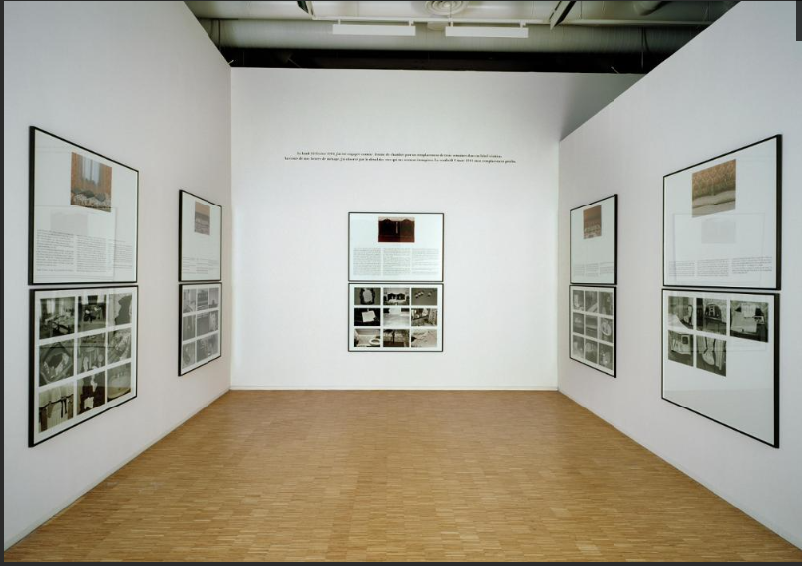
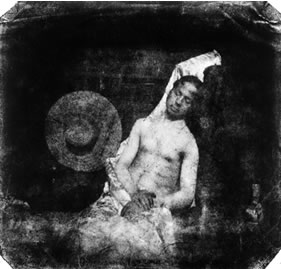
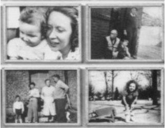

### [Séance 3] 

### La "photobiographie" 

<!-- .element: style="width:450px" -->

===

§§§§§§§§§§§§§§§§§§§§§§§§§§§§§§§§§§§§§§§§§§§§§

* Que vous évoque le mot-valise "photobiographie" ? 

=> Un mot-valise est un mot formé par la fusion d'au moins deux mots existant dans la langue. Pour qu’un mot composé soit un mot-valise, il faut qu’un son au moins soit commun aux mots qu’on y a fait fusionner.

<!-- .element: style="font-size:1.6rem" -->

*Exemples :* Brexit, infobésité, motel, infox, Brangelina...

<!-- .element: style="font-size:1.6rem" -->

===

§§§§§§§§§§§§§§§§§§§§§§§§§§§§§§§§§§§§§§§§§§§§§

* Que vous évoque le mot-valise "photobiographie" ? 

Photobiographie est un mot-valise qui joue de la concaténation entre photographie et autobiographie. 

<!-- .element: style="font-size:1.6rem" -->

Le terme est né sous la plume de l'écrivain et plasticien Gilles Mora qui publie, en 1983, un *Manifeste photobiographique*.

<!-- .element: style="font-size:1.6rem" -->

===

§§§§§§§§§§§§§§§§§§§§§§§§§§§§§§§§§§§§§§§§§§§§§

« La photographie, donc, redoublera notre vie. Témoin biographique par essence, nous la ferons rebondir de toutes nos forces au cœur de notre projet autobiographique, jusqu’à ne plus savoir s’il convient de vivre pour photographier, ou l’inverse. » (Mora, 1983 : 103).

<!-- .element: style="font-size:1.6rem" -->

===

Projet par la suite avorté.

§§§§§§§§§§§§§§§§§§§§§§§§§§§§§§§§§§§§§§§§§§§§§

## Photographie et autobiographie, de fausses amies ? 

Dans cette séance, nous allons interroger les relations entre l'écriture de soi et la photographie. Mais d'abord, commençons par définir et conceptualiser les termes du cours.

<!-- .element: style="font-size:1.6rem" -->

§§§§§§§§§§§§§§§§§§§§§§§§§§§§§§§§§§§§§§§§§§§§§

* Qu'est-ce que l'autobiographie ? 

===

§§§§§§§§§§§§§§§§§§§§§§§§§§§§§§§§§§§§§§§§§§§§§

Étymologiquement, "auto-bio-graphie" signifie "Écrire soi-même le récit de sa vie".

<!-- .element: style="font-size:1.6rem" -->

L’autobiographie est un genre de récit de soi (comme les mémoires, le journal intime, les confessions, etc.), qui se reconnaît en temps que tel à la toute fin du 18è siècle (invention du mot), pour devenir l’un des genres majeurs du 20e siècle. C'est au 20e siècle que l'autobiographique va faire l'objet d'un important travail théorique de conceptualisation (Philippe le jeune, *Le Pacte autobiographique*).

<!-- .element: style="font-size:1.6rem" -->

===

L'autobiographie est un genre littéraire qui appartient plus largement à la catégorie des "récits de soi". Étymologiquement, "auto-bio-graphie" signifie "Écrire soi-même le récit de sa vie".

Les récits de soi sont une pratique ancienne, et l'histoire de la littérature en comprend de nombreux exemples depuis les *Confessions* de Saint Augustin, par exemple, ou encore à travers la pratique d'écriture des journaux intimes. Pourtant, le terme "autobiographique" est plus récent. Il a été forgé par Philippe Lejeune. 

L’autobiographie, écriture de soi, est un genre assez ancien (qui peut puiser son origine dans les mémoires, par exemple celles de Jules César, qui écrit au 1er siècle avant JC La Guerre des Gaules), qui se reconnaît en temps que tel à la toute fin du 18è siècle (invention du mot), pour devenir l’un des genres majeurs du 20e siècle, qui va le théoriser (Philippe le jeune, Le Pacte autobiographique) et le briser, avec l’avènement de l’autofiction.

§§§§§§§§§§§§§§§§§§§§§§§§§§§§§§§§§§§§§§§§§§§§§

### Philippe Lejeune, *Le pacte autobiographique*

Le pacte autobiographique est un contrat tacite passé avec le lecteur, balisant ainsi son horizon d'attente : l’auteur s’engage à respecter un certain nombre de démarches, en contrepartie desquelles le lecteur s’engage à accepter comme véridique ce que dit l’auteur. 

<!-- .element: style="font-size:1.6rem" -->

§§§§§§§§§§§§§§§§§§§§§§§§§§§§§§§§§§§§§§§§§§§§§

Le pacte autobiographique comprend deux pierres angulaires :

<!-- .element: style="font-size:1.6rem" -->

* La première est la question de l’identité entre l’auteur, le narrateur et le personnage.
>« Il faut qu’il y ait identité du narrateur, de l’auteur et du personnage. La personne qui énonce le discours doit permettre son identification à l’intérieur même de ce discours. » (Lejeune, 1996 : 15).

<!-- .element: style="font-size:1.6rem" -->

* La seconde est l’exigence de véridicité, que P. Lejeune appelle le « pacte référentiel ».
>« La formule en serait non plus “Je soussigné”, mais “Je jure de dire toute la vérité, rien que la vérité” ». (Lejeune, 1996 : 36).

<!-- .element: style="font-size:1.6rem" -->

§§§§§§§§§§§§§§§§§§§§§§§§§§§§§§§§§§§§§§§§§§§§§

* À quelles difficultés le genre autobiographique peut-il selon vous se heurter ? 

§§§§§§§§§§§§§§§§§§§§§§§§§§§§§§§§§§§§§§§§§§§§§

### Le défi autobiographique
* Les difficultés liées à la **mémoire** : la pratique autobiographique nécessite un recul qui entraîne des oublis et des déformations
* Les difficultés liées à la **sincérité** : l'autobiographe n'est jamais totalement objectif, de manière consciente ou inconsciente
* Les difficultés liée à l'**écriture** : comment trouver les mots justes pour retranscrire les faits et les émotions passées ?
* La nécessité d’inventer de nouvelles **formes** : l'autobiographie explore les formes narratives et poétiques pour mieux évoquer le passé (forme limite : l'autofiction)

<!-- .element: style="font-size:1.6rem" -->

===

a) Les difficultés liées à la mémoire
L’autobiographie nécessite un recul qui entraîne des oublis et des déformations. Sarraute écrit Enfance à 83 ans, La Vie de Henry Brulard de Stendhal est parsemée d’interruptions et demeure inachevée. Certains auteurs choisissent de combler ces trous par leur imagination, d’autres se contentent de les constater.

b) Les difficultés liées à la sincérité
L’autobiographe n’est jamais totalement objectif et ne peut échapper à la reconstruction ou à la réinterprétation des événements passés, comme le note Gide « les mémoires ne sont jamais qu’à demi sincères, si grand que soit le souci de vérité : tout est toujours plus compliqué qu’on ne le dit. » (Si le grain ne meurt). Mauriac, de son côté, affirme : « nous finissons toujours par nous justifier » (Commencements d’une vie).

c) Les difficultés liée à l'écriture
Il est souvent difficile de trouver les mots justes et le style qui parviendra à retranscrire les émotions passées : « comment peindre le bonheur fou » s’interroge Stendhal dans un passage de La Vie de Henry Brulard.
Pour rester au plus près des sensations, Sarraute choisit une écriture à la fois sobre et poétique ; Annie Ernaux, elle, opte pour une écriture blanche, c’est-à-dire neutre, dans Une Femme (1989).

d) La nécessité d’inventer de nouvelles formes
Souvent, l’autobiographe ne se contente pas des formes traditionnelles de l’autobiographie, mais invente une forme nouvelle plus à même de retrouver le temps perdu. Ainsi Perec juxtapose dans W ou le souvenir d’enfance (1975), un texte fictif proche de la contre-utopie et un texte authentique qui se présente comme une autobiographie très lacunaire. Juliet mêle dans Lambeaux biographie et autobiographie, toutes les deux écrites à la deuxième personne du singulier. Sarraute imagine dans Enfance (1983) une œuvre dialoguée qui retranscrit une conversation avec sa conscience.

§§§§§§§§§§§§§§§§§§§§§§§§§§§§§§§§§§§§§§§§§§§§§

* Commentez cette citation de Philippe Lejeune :

> « L’ autobiographie ne dit pas vrai , elle dit qu’elle dit vrai . »

§§§§§§§§§§§§§§§§§§§§§§§§§§§§§§§§§§§§§§§§§§§§§

* À quoi peut-on reconnaître une autobiographie ? 

§§§§§§§§§§§§§§§§§§§§§§§§§§§§§§§§§§§§§§§§§§§§§

### Les principales caractéristiques narratives et stylistiques de l'autobiographie

* [Énonciation] Un récit à la première personne du singulier 
* [Pacte autobiographique] "JE" = narrateur = auteur = personnage
* [Temps verbaux] Association entre des temps du passé (évocation d'un temps révolu, de l'enfance, etc.), mais également du présent (puisqu'il s'agit d'analyser qui nous sommes aujourd'hui à la lumière du passé). Par ailleurs, l'autobiographie obéit souvent à une logique chronologique : on part de l'enfance, pour arriver jusqu'au moment où l'auteur écrit son récit.
* [Champs lexicaux] : sentiments, émotions, intimité, confession
* [Thèmes] : famille, amours, amis, aveux, histoire d'un conflit.

<!-- .element: style="font-size:1.6rem" -->

§§§§§§§§§§§§§§§§§§§§§§§§§§§§§§§§§§§§§§§§§§§§§

* Pourquoi écrit-on son autobiographie ? 

§§§§§§§§§§§§§§§§§§§§§§§§§§§§§§§§§§§§§§§§§§§§§

### Les objectifs de l'autobiographie
* Mieux se connaître et se comprendre
* Laisser une trace
* Témoigner
* Se confesser (avouer une faute)

<!-- .element: style="font-size:1.6rem" -->

### Entre introspection et rétrospection

* Un travail d'introspection : l'auteur mène une observation méthodique sur sa vie intérieure et son intimité 
<!-- .element: style="font-size:1.6rem" -->

* Un travail de rétrospection : l'auteur porte un regard en arrière sur les faits passés.
<!-- .element: style="font-size:1.6rem" -->

§§§§§§§§§§§§§§§§§§§§§§§§§§§§§§§§§§§§§§§§§§§§§

* En quoi la photographie peut, selon vous, s'avérer utile pour construire les récits autobiographiques ? 

§§§§§§§§§§§§§§§§§§§§§§§§§§§§§§§§§§§§§§§§§§§§§

* La photo peut faciliter le travail de remémoration
* La photo peut jouer un rôle de preuve, de témoignage du passé

<!-- .element: style="font-size:1.6rem" -->

§§§§§§§§§§§§§§§§§§§§§§§§§§§§§§§§§§§§§§§§§§§§§

* Quelles seraient, au contraire, les difficultés que la photographie peut présenter pour raconter sa propre vie (rappelez-vous de Roland Barthes) ? 

§§§§§§§§§§§§§§§§§§§§§§§§§§§§§§§§§§§§§§§§§§§§§

* Nous ne sommes pas (forcément) l'auteur des photographies (vs. le pacte autobiographique)
* La photographie peut s'avérer déceptive ou mensongère

<!-- .element: style="font-size:1.6rem" -->

§§§§§§§§§§§§§§§§§§§§§§§§§§§§§§§§§§§§§§§§§§§§§

>Lorsque le sujet de l’autobiographie est aussi celui de la photographie d’enfance, l’écrivain se trouve dans une situation intéressante ; il peut établir un contact visuel concret, avec une image de lui, et par là même une apparence, une époque de sa vie, qui ont disparu. Non seulement ce temps n’est plus mais, bien souvent, il a été oublié. La photographie est donc beaucoup plus qu’une illustration : médiation de soi à soi, elle reconstruit, véritablement, un monde. 

>Véronique Montémont, "Le pacte autobiographique et la photographie", 2008.

<!-- .element: style="font-size:1.6rem" -->

§§§§§§§§§§§§§§§§§§§§§§§§§§§§§§§§§§§§§§§§§§§§§

* Quels pourraient être les genres photographiques qui correspondent à l'écriture autobiographique ? 

§§§§§§§§§§§§§§§§§§§§§§§§§§§§§§§§§§§§§§§§§§§§§

* L'autoportrait

<!-- .element: style="width:400px" -->

<!-- .element: style="width:50%;float:right;margin-right:-3em;" -->

« Autoportrait en noyé » d’Hippolyte Bayard (1840). Dans cet autoportrait, Bayard se met en scène en suicidé, et signe au dos de l’image son testament. Paradoxalement, la première représentation photographique de soi, le premier autoportrait photographique, procède davantage d’une mise en scène fictionnelle que d’un enregistrement fidèle du réel.

<!-- .element: style="font-size:1.5rem; width:50%;float:left;margin-left:-3em;" -->

=== 

l’un des tous premiers autoportraits = « Autoportrait en noyé » d’Hippolyte Bayard (1840). C’est cependant déjà une représentation problématique, car le photographe se met en scène en noyé, figure sa propre mort.
En fait, à peut près en même temps que Daguerre, Hyppolite Bayard avait mis au point un procédé lui permettant d'obtenir des positifs directs sur papier. C’est-à-dire qu’il était lui aussi un inventeur de la photo (son procédé était cependant différent que celui de Daguerre et Niepce), mais il va déposer son brevet trop tard, et si l’académie des sciences reconnaît son travail, elle va surtout donner tout le crédit à Daguerre. De même, c’est le daguerréotype qui va connaître le véritable succès économique.
Fâché par ce manque de reconnaissance, Bayard se met donc en scène en suicidé, et signe au dos de l’image son testament.

C’est donc une seconde invention qu’il réalise après que la première n’ait pas été reconnue : la fiction photographique.

D’où le paradoxe : la première représentation photographique de soi, le premier autoportrait photographique, procède davantage d’une mise en scène fictionnelle que d’un enregistrement fidèle du réel.

§§§§§§§§§§§§§§§§§§§§§§§§§§§§§§§§§§§§§§§§§§§§§

* La photo de famille ou l'album de famille

<!-- .element: style="width:400px" -->

<!-- .element: style="width:50%;float:right;margin-right:-3em;" -->

L’Album de la famille D. (Christian Boltanski, 1971) est un album de famille reconstitué à partir des clichés d’une même famille dont l’identité n’est jamais révélée. Cet anonymat n’a guère d’importance : ces photos nous ressemblent, puisque la photo de famille est une pratique partagée par tous. La photographie est ainsi habitée par une dimension proprement collective surgissant là où on l’attend le moins, puisque l’on a tendance à croire au contraire qu’elle a quelque chose d’unique, puisque c’est une empreinte du réel.

<!-- .element: style="font-size:1.5rem; width:50%;float:left;margin-left:-3em;" -->

===

Album de famille/ pratique très ancienne, invention photographique de la fin du dix-neuvième siècle, dans laquelle se dessine une sociologie de la famille – une histoire du fait photographique.

L’Album de la famille D., reconstitué à partir des clichés d’une même famille dont l’identité n’est jamais révélée. 
Cet anonymat n’a d’ailleurs guère d’importance, puisque lorsqu’on regarde ces images, ce sont nos propres souvenirs de vacances au bord de mer et d’interminables repas en famille que rappellent chacun des clichés où n’évoluent pourtant que de parfaits inconnus. 
Sur ces clichés, ce pourrait être notre propre famille et pour cause : nous prenons tous les mêmes clichés. Nous sommes tous conditionnés dans une certaine pratique du médium. Exemple : la traditionnelle photo de mariage, la photo du ventre la femme enceinte, la photo de la communion, etc.

pas besoin de regarder nos propres images : les images des inconnus pourraient suffire à nous contenter, suscitant d’étranges sentiments de familiarité, de curieux effets d’affiliations. 
La photographie est ainsi habitée par une dimension proprement collective surgissant là où on l’attend le moins, puisque l’on a tendance à croire au contraire qu’elle a quelque chose d’unique, puisque c’est une empreinte du réel (et on se souvient, même, de cette croyance au 19e selon laquelle la photo pouvait capter des couches d’âme).

§§§§§§§§§§§§§§§§§§§§§§§§§§§§§§§§§§§§§§§§§§§§§

Nous pouvons définir comme *photobiographique* tout texte respectant les critères du pacte autobiographique et comprenant des photographies.

<!-- .element: style="font-size:1.6rem" -->

§§§§§§§§§§§§§§§§§§§§§§§§§§§§§§§§§§§§§§§§§§§§§

## Étude de cas : *Histoires vraies* de Sophie Calle